# TripMate Mobile Application
 
A mobile applications for travelers to help them by providing all traveling services they need.

#Homepage
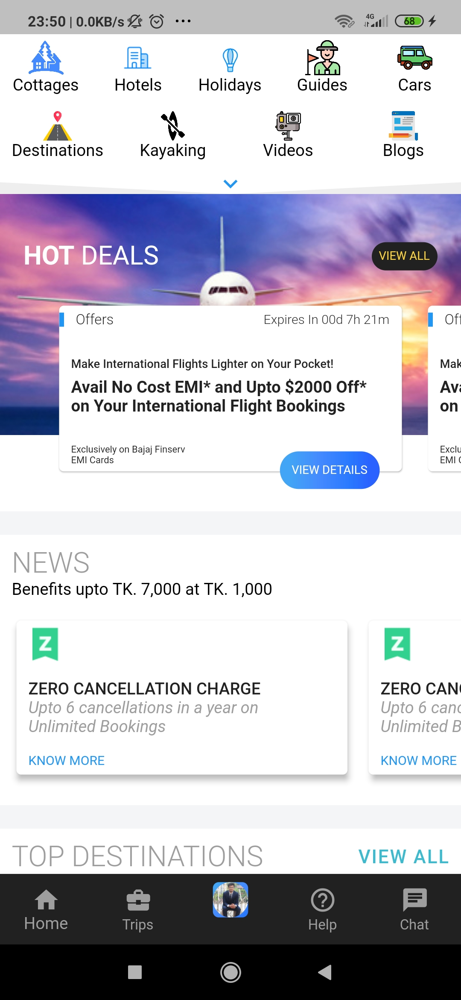

#Trip Booking Page
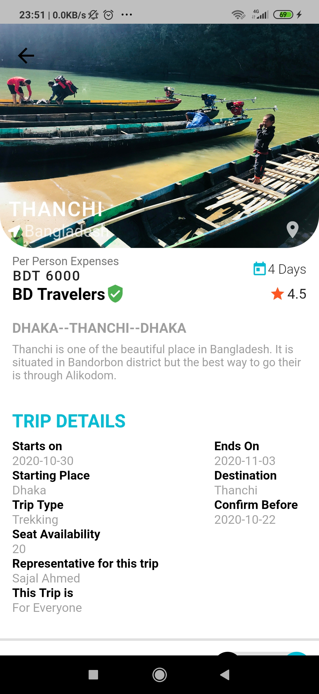
#Chat Page
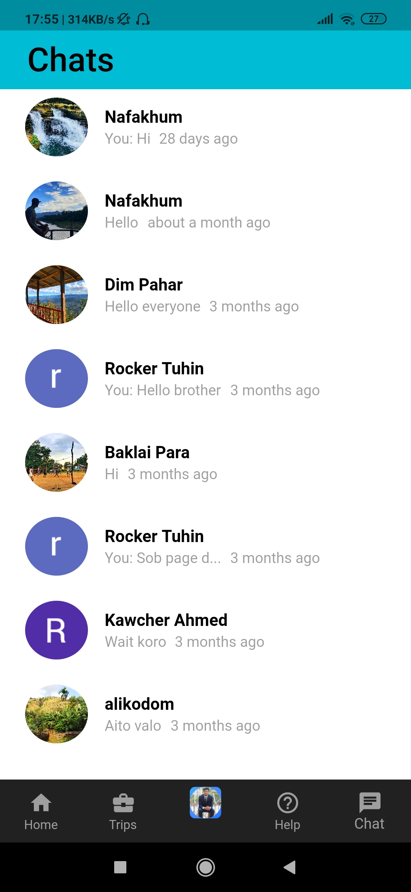
#User Profile
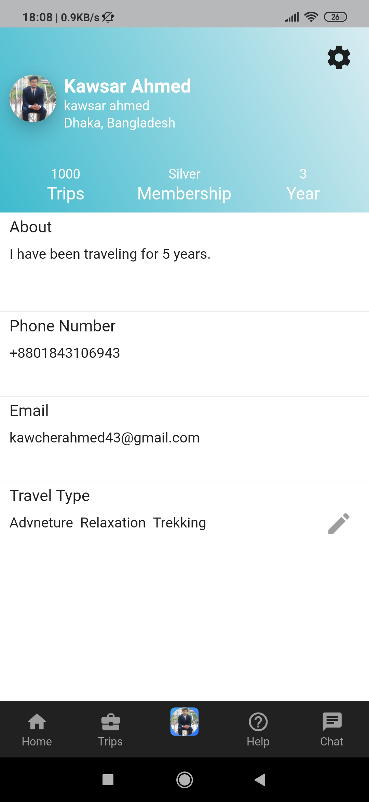
#Profile Settings
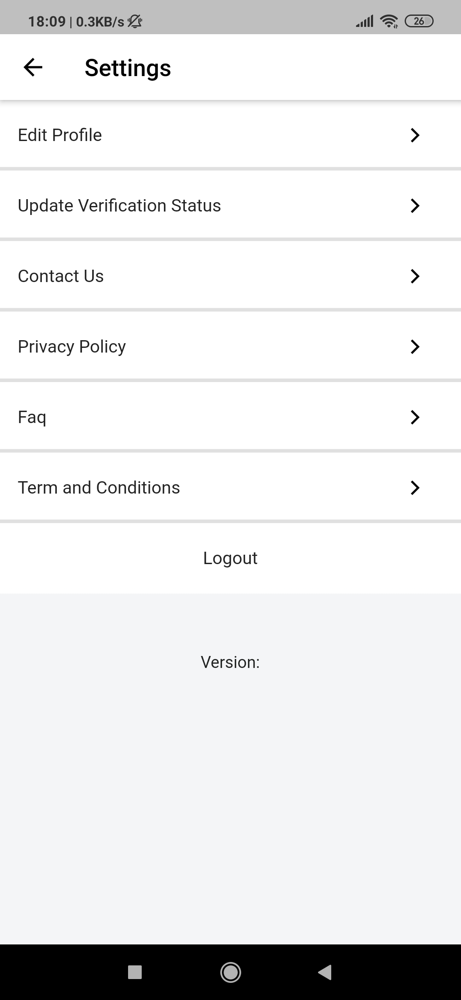
#Trip History
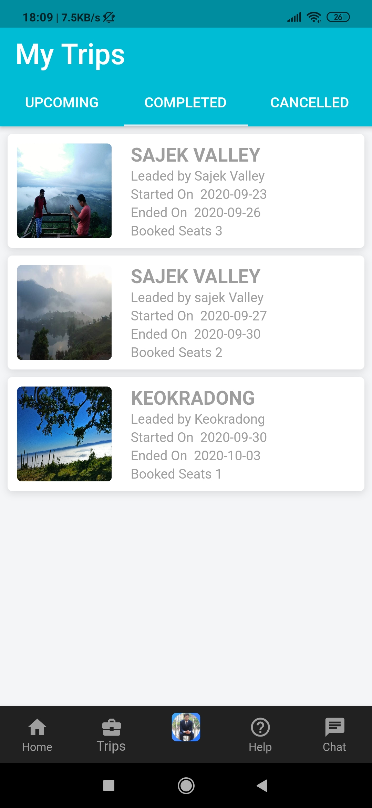
#Booking Details
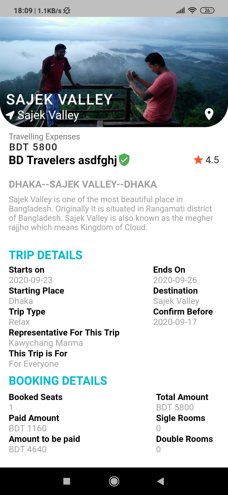
#All Trips
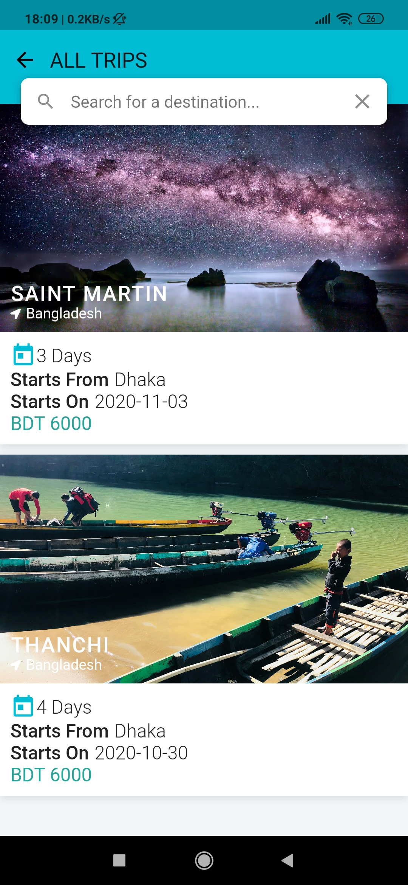
#TRip Booking
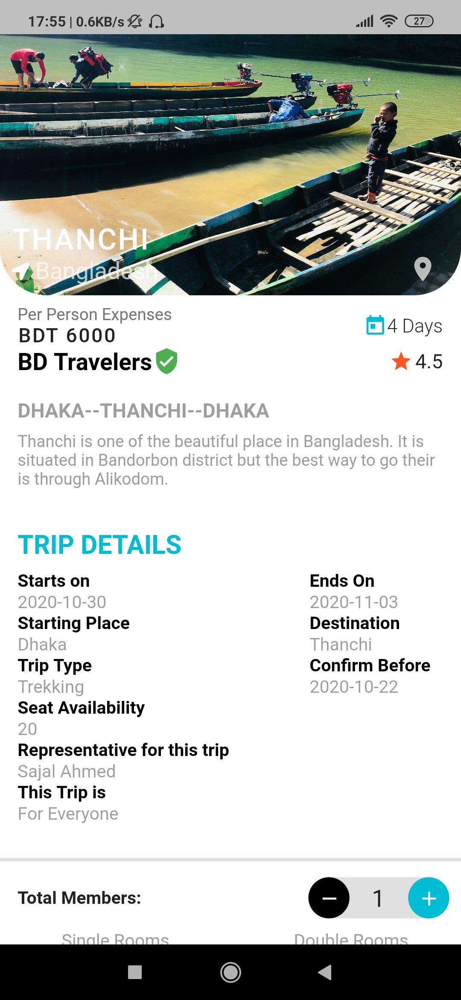
#Travel Blogs
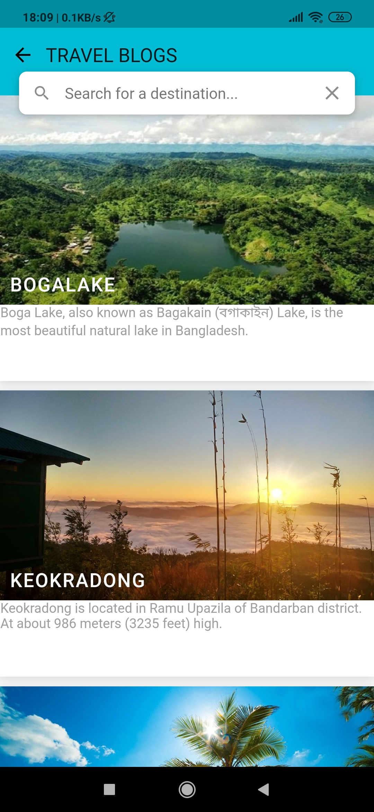
#Home Page Bottom
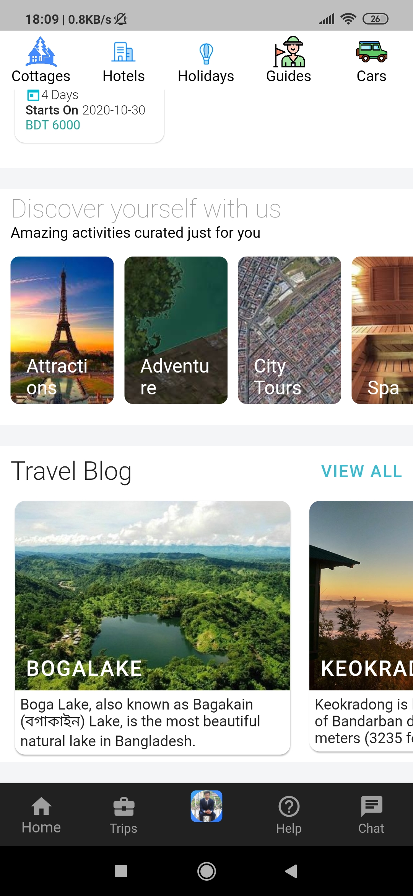

Technologies used:

  - Flutter
  - Cloud Firestore
